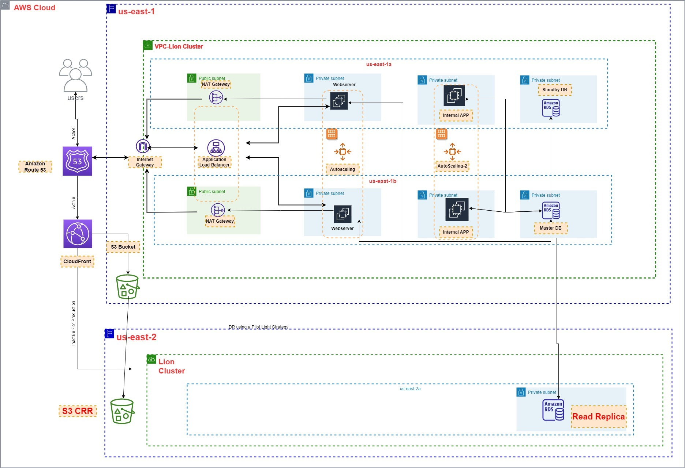

#  DevOps-on-AWS
This repository will contain all devops project on AWS 
# DEVOPS PROJECT1
Setup a two stage CI/CD pipeline using CODEPIPELINE to automatically deploy a static website on AMAZON S3 Bucket. The website is will display a simple HTML webpage. 

# DEVOPS PROJECT1

